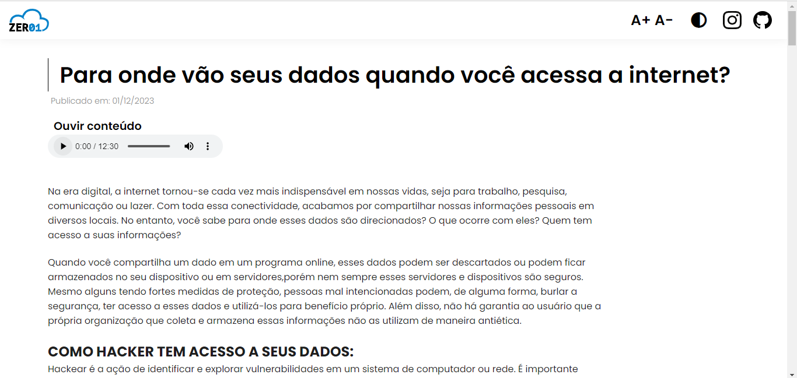
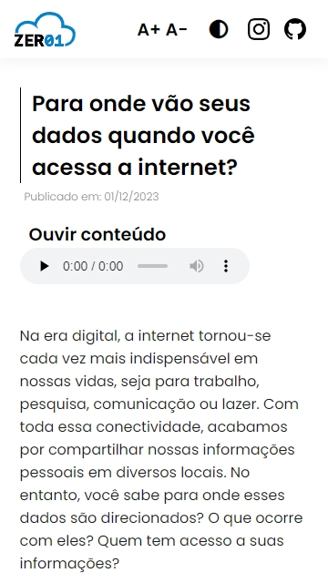
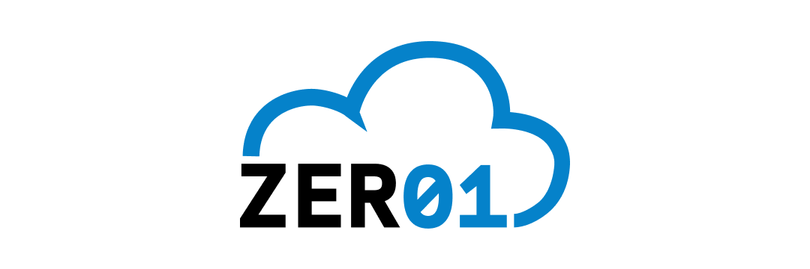

# Para onde vão seus dados?

Esse projeto foi criado com o intuito de informar aos usuários o que acontece com suas informações pessoais na internet e como podemos engajar na proteção de dados pessoas e na libredade de software.

 ### [Acesse o projeto](https://dataway.netlify.app/)

Esse website foi pensado para ter o maximo de acessibilidade possível.

- Responsivo
- Semântico
- Modo escuro
- Opção de aumentar letra
- Alto contraste de texto
- Conteúdo em audio
- Versão ajustada para impressão 

> website visualizado em um computador.

> Website visualizado no celular

***

Projeto criado pela "Equipe Zero1", para o trabalho final da matéria **Computador, Ética e Sociedade** da **Universidade Federal da Bahia**.

