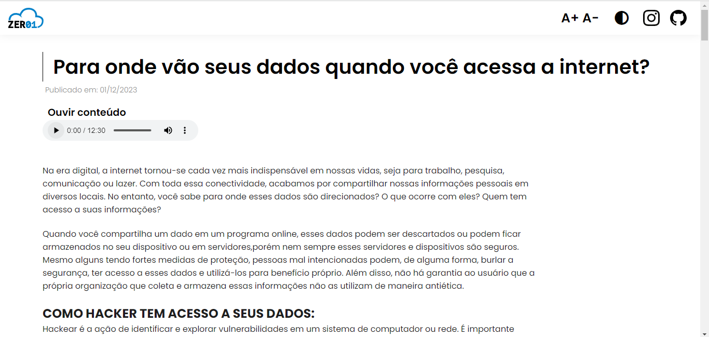
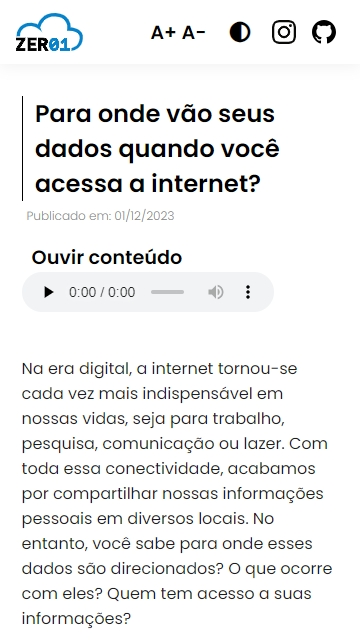

# Para onde vão seus dados?

Esse projeto foi criado com o intuito de informar aos usuários o que acontece com suas informações pessoais na internet e como podemos engajar na proteção de dados pessoas e na libredade de software.

Esse website foi pensado para ter o meximo de acessibilidade possível.

- Responsivo
- Modo escuro
- Opção de aumentar letra
- Alto contraste de texto
- Conteúdo em audio

> webisite visualizado em um computador.

> Website visualizado no celular

***
Projeto criado pela "Equipe Zero1", criado para o trabalho final da matéria **Computador, Ética e Sociedade** da **Universidade Federal da Bahia**.

